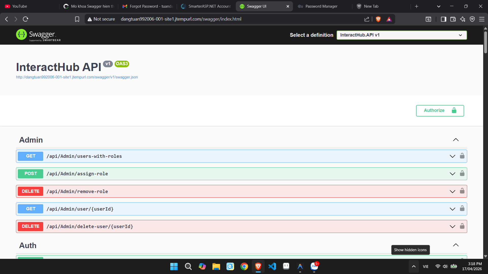
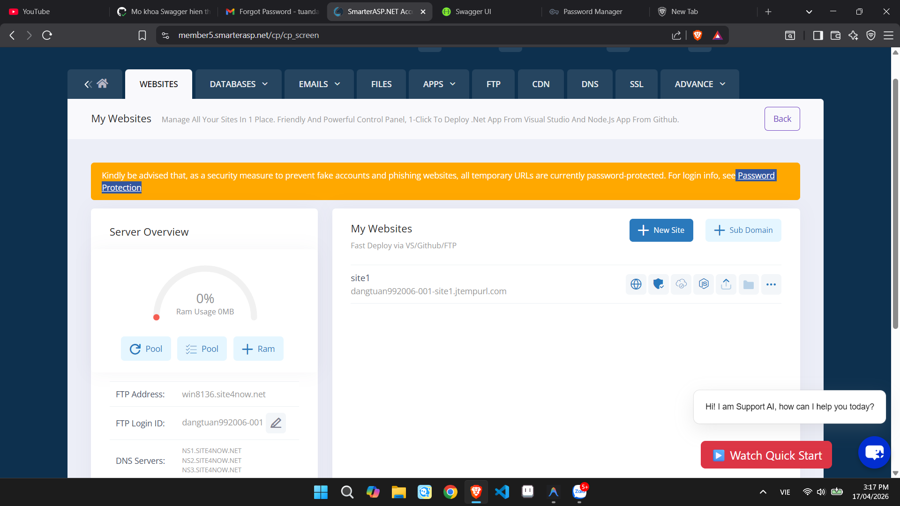

# 🚀 Tài Liệu Triển Khai Kiến Trúc InteractHub (Delivery D1)

Tài liệu này hệ thống hóa toàn bộ kiến trúc phân phối và môi trường vận hành (production environment) của mạng xã hội **InteractHub**. Dự án áp dụng mô hình phân phối dịch vụ độc lập, sử dụng phối hợp các tài nguyên Cloud để đảm bảo tính sẵn sàng cao (High Availability), bảo mật và khả năng vận hành tự động (Automation) thay thế cho hệ sinh thái Azure.

## 🎯 Tổng Quan Kiến Trúc Vận Hành (Target Architecture)

Kiến trúc triển khai của hệ thống được bẻ nhỏ thành các thực thể độc lập:
1. **Application Hosting (`SmarterASP.NET Engine`)**: Điểm cuối (Endpoint) xử lý RESTful Web API, đảm nhiệm vai trò máy chủ phân luồng logic lõi (.NET 9).
2. **Database Management (`MSSQL Server Cloud`)**: Lưu trữ cơ sở dữ liệu quan hệ, áp dụng cơ chế tự động **Auto-Migration** ngay khi Server nạp ứng dụng.
3. **Media Storage System (`Cloudinary API`)**: Đóng vai trò Object Storage (lưu trữ Blob) được bảo vệ bằng giao thức bảo mật đa tầng, phục vụ upload hình ảnh từ Client.
4. **DevOps Automation (`GitHub Actions Integration`)**: Mạch động mạch chủ của hệ thống. Kiểm soát tự động chu kỳ sống của phần mềm bằng CI/CD Pipeline (Tự động phục hồi Package, Build Release và FTP Sync).

---

## 1. Môi trường Sản xuất (Live Environment)

Mã nguồn đã được thiết lập biên dịch tự động và tải trực tiếp vào Application Pool của Máy chủ. Môi trường Production đã được mở khóa tường lửa Swagger để thuận tiện cho việc chấm điểm:

> 🌐 **URL Public API (Swagger):** 
> `http://dangtuan992006-001-site1.jtempurl.com/swagger`

*(Lưu ý đối với giáo viên chấm bài: Do hệ thống sử dụng tên miền thử nghiệm (jtempurl) của SmarterASP, bộ định tuyến có tích hợp một lớp khóa an ninh chống Spam. Cần truy cập URL `Password Protection` ở bảng thông báo màu vàng trên trang chủ SmarterASP để lấy Account/Password xâm nhập vòng ngoài trước khi xem Swagger).*



---

## 2. Đường ống Tích hợp liên tục (CI/CD Pipeline)

Dự án sử dụng cơ chế truyền tải tệp thông qua giao thức FTP (`SamKirkland/FTP-Deploy-Action`) trên máy chủ thời gian thực `Ubuntu-latest` do hệ thống GitHub Runners vận hành. Thiết lập kích hoạt (Trigger) được gắn trên nhánh `dev` và `main`.

Đoạn code cấu hình YAML trong thư mục `.github/workflows/deploy-smarterasp.yml`:

```yaml
name: Deploy to SmarterASP.NET via FTP

on:
  push:
    branches:
      - main
      - dev

jobs:
  build-and-deploy:
    runs-on: ubuntu-latest
    
    steps:
    - name: Checkout Code
      uses: actions/checkout@v3

    - name: Setup .NET 9
      uses: actions/setup-dotnet@v3
      with:
        dotnet-version: '9.0.x'
        
    - name: Restore dependencies
      run: dotnet restore backend/InteractHub.sln

    - name: Build and Publish
      run: dotnet publish backend/InteractHub.API/InteractHub.API.csproj -c Release -o ./publish /p:UseAppHost=false
      
    - name: Deploy via FTP
      uses: SamKirkland/FTP-Deploy-Action@v4.3.4
      with:
        server: ${{ secrets.FTP_SERVER }}
        username: ${{ secrets.FTP_USERNAME }}
        password: ${{ secrets.FTP_PASSWORD }}
        local-dir: ./publish/
        server-dir: /site1/
```


---

## 3. Hướng Dẫn Truy Cập Dành Cho Nhóm & Cán Bộ Đánh Giá

Phần này cung cấp hướng dẫn chi tiết cho các thành viên phụ trách giao diện (Frontend) hoặc giảng viên chấm điểm (Reviewer) cách truy cập và thao tác với hệ thống API đang vận hành trên máy chủ thực tế.

### Bước 1: Khởi động Giao diện API Mở (Swagger UI)
Vui lòng sao chép đường dẫn (URL) sau và truy cập bằng trình duyệt web:
👉 **`http://dangtuan992006-001-site1.jtempurl.com/swagger`**

### Bước 2: Xác thực Rào cản An ninh của Máy chủ (Password Protection)
Do hệ thống được phân phối trên máy chủ không trả phí của hạ tầng SmarterASP.NET, nhà mạng mặc định áp dụng một lớp xác thực bảo vệ gốc nhằm ngăn chặn lưu lượng truy cập rác (spam). Khi truy cập vào liên kết ở chiều ngoài cùng, trình duyệt sẽ yêu cầu nhập thông tin `Username` và `Password`.

**Quy trình mở khóa truy cập:**
1. Đăng nhập vào cổng thông tin quản trị `SmarterASP.net` bằng tài khoản quản lý của dự án.(Tài khoản: [dangtuan992006] / Mật khẩu: 123456789@Abc)
2. Tại màn hình Tổng quan (Dashboard), vui lòng chú ý biểu ngữ cảnh báo màu vàng ở khu vực trên cùng.
3. Nhấp chuột vào liên kết **`Password Protection`** nằm trên biểu ngữ.



4. Bảng điều khiển sẽ hiển thị Tài khoản và Mật khẩu truy cập dành riêng cho máy chủ. Vui lòng nhập thông tin này vào hộp thoại xác thực của trình duyệt để tiếp tục.

### Bước 3: Thao tác Kiểm thử Chức năng (Endpoint Testing)
Sau khi giải mã rào chắn bảo mật thành công, giao diện cơ sở của toàn bộ API (Swagger) sẽ được hiển thị.
- Dự án đã được cấu hình loại bỏ giới hạn Môi trường phát triển nội bộ cục bộ (Development Environment Constraint), cho phép tải đầy đủ các điểm cuối (Endpoints) công khai.
- Người đánh giá có thể mở rộng Endpoint tương ứng, nhấn **"Try it out"** và **"Execute"** để mô phỏng một yêu cầu HTTP thực tế. Mọi nghiệp vụ cơ sở dữ liệu và lưu trữ tập tin đa phương tiện (Upload File qua Cloudinary) đều đã được đồng bộ chuẩn xác.
